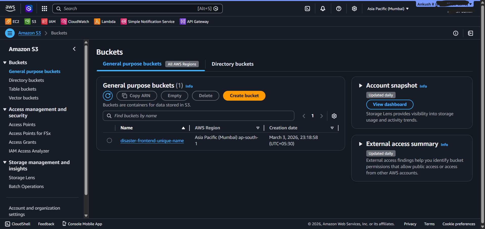
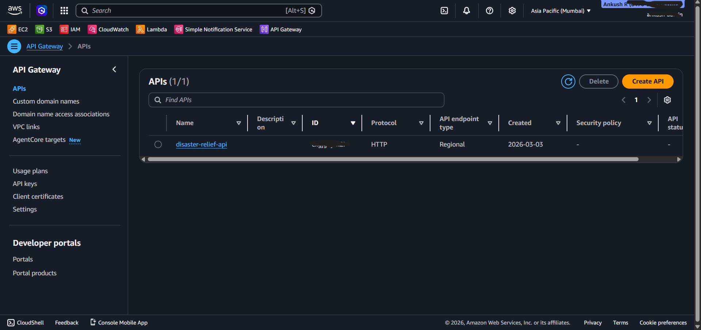
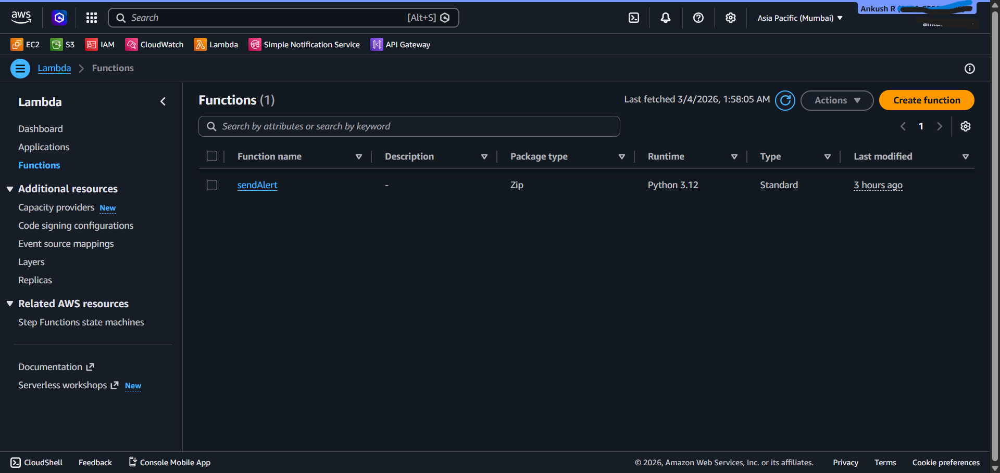
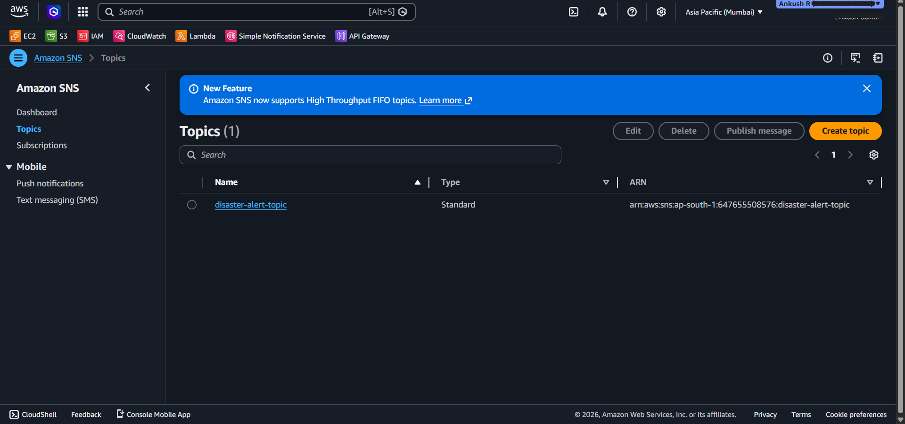
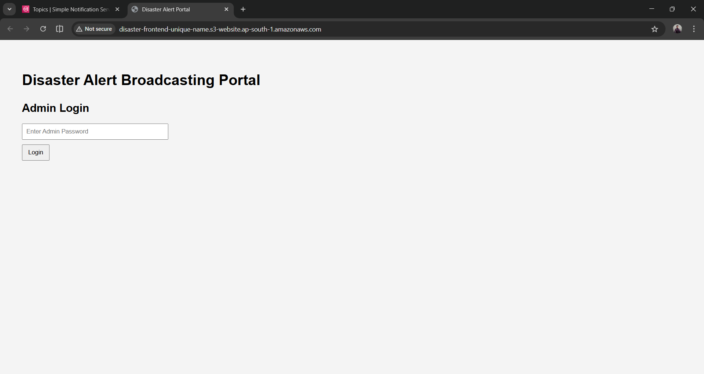
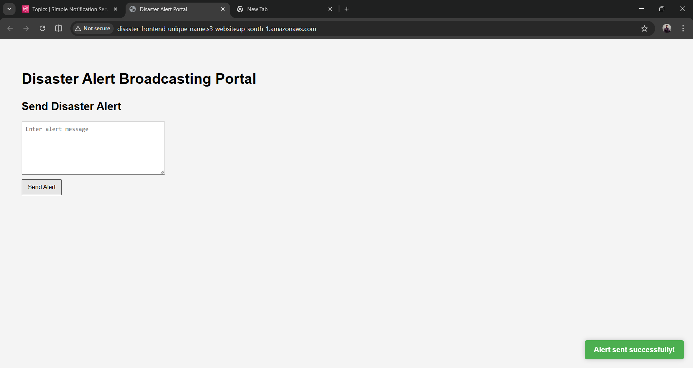
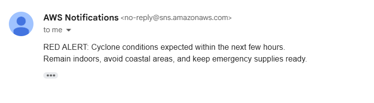

# 🚨 Disaster Alert Broadcasting Portal

A cloud-native, serverless disaster alert broadcasting system built on AWS.  
The platform enables administrators to securely publish emergency alerts that are distributed to subscribers via email using an event-driven architecture.

---

## 📌 Executive Summary

This project demonstrates the design and deployment of a fully serverless alert broadcasting system using AWS managed services. It eliminates server management while ensuring scalability, reliability, and cost-efficiency under the AWS Free Tier.

The system is optimized for:

- Emergency alert distribution
- High scalability
- Minimal operational overhead
- Event-driven cloud architecture

---

## 🏗 System Architecture

```
Client (Browser - S3 Hosted Website)
        ↓
Amazon API Gateway (HTTP API)
        ↓
AWS Lambda (sendAlert Function)
        ↓
Amazon SNS Topic
        ↓
Email Subscribers
```

---

## ☁️ AWS Services Used

### 🗂 Amazon S3
- Hosts static frontend (HTML, CSS, JavaScript)
- Configured for static website hosting
- Public read access for web assets

### 🌐 Amazon API Gateway
- HTTP API for routing alert requests
- CORS configured for browser communication
- Integrated with Lambda backend

### ⚡ AWS Lambda
- Serverless backend logic
- Processes alert messages
- Publishes events to SNS
- IAM role-based permissions

### 📢 Amazon SNS
- Handles fan-out message distribution
- Sends email notifications to confirmed subscribers
- Highly scalable, event-driven messaging

### 🔐 AWS IAM
- Role-based access control
- Principle of least privilege enforced for Lambda execution

---

## 🔐 Security Design

- IAM execution role restricts Lambda to SNS publish permissions only.
- API Gateway endpoint protected via frontend login (demo-level authentication).
- Sensitive credentials are not exposed in the repository.
- Public S3 bucket contains only static assets (no secrets).

> Note: Authentication is implemented client-side for demonstration purposes. Production deployment would use Amazon Cognito or JWT-based backend authorization.

---

## 🚀 Features

- Admin login interface
- Real-time disaster alert broadcasting
- SNS-based email notification delivery
- Serverless deployment
- Fully AWS Free Tier compatible
- Lightweight, scalable architecture

---

## 🧠 Design Decisions

### Why Serverless?
- Eliminates server provisioning
- Automatic scaling
- Cost-efficient (pay-per-request model)
- Reduced operational complexity

### Why SNS?
- Native AWS pub-sub service
- High throughput
- Managed email distribution
- Reliable fan-out messaging pattern

### Why Static Hosting on S3?
- Low cost
- Highly durable
- Globally accessible
- Simplifies frontend deployment

---

## 📸 System Screenshots

### S3 Static Hosting


### API Gateway Configuration


### Lambda Function


### SNS Topic


### Admin Login Interface


### Alert Sent Popup


### Email Received


---

## 📊 Scalability & Reliability

- Stateless Lambda architecture
- SNS ensures reliable message delivery
- No persistent server dependency
- Horizontally scalable without configuration changes

The system can handle increased traffic automatically without infrastructure modification.

---

## 💰 Cost Considerations

Designed to operate within AWS Free Tier limits:

- Lambda: 1M requests/month free
- SNS: 1M publishes/month free
- API Gateway: 1M HTTP requests/month free
- S3: Free Tier storage + request limits

---

## 🔄 Alert Flow

1. Admin logs into portal.
2. Admin enters disaster alert message.
3. Browser sends POST request to API Gateway.
4. API Gateway triggers Lambda function.
5. Lambda publishes alert to SNS topic.
6. SNS distributes email notifications to subscribers.

---

## 🛠 Deployment Steps (High-Level)

1. Create S3 bucket and enable static website hosting.
2. Deploy frontend files (HTML, CSS, JS).
3. Create Lambda function (`sendAlert`).
4. Create SNS topic and confirm email subscriptions.
5. Configure API Gateway route to Lambda.
6. Enable CORS.
7. Attach IAM permissions to Lambda.

---

## 📈 Future Enhancements

- Backend authentication using Amazon Cognito
- SMS notifications via SNS
- Alert logging with DynamoDB
- Role-based admin management
- CloudFront CDN integration
- Custom domain via Route 53

---

## 🎯 Key Learning Outcomes

- Serverless architecture design
- IAM policy configuration
- API Gateway–Lambda integration
- CORS debugging and configuration
- Event-driven cloud messaging
- End-to-end AWS service orchestration

---

## 👨‍💻 Author

Anku  
Cloud & Serverless Architecture Enthusiast
